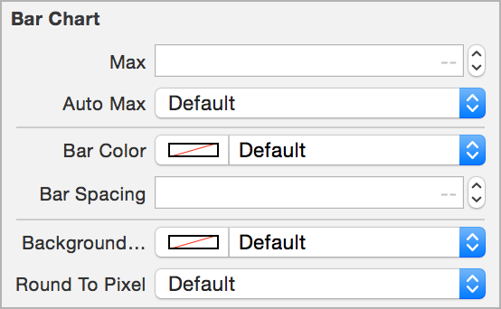

# TEAChart

[](https://travis-ci.org/xhacker/TEAChart)
[](http://cocoadocs.org/docsets/TEAChart/)
[](https://github.com/xhacker/TEAChart/blob/master/LICENSE)
[](http://cocoadocs.org/docsets/TEAChart/)

Simple and intuitive iOS chart library, for [Pomotodo](https://itunes.apple.com/app/fan-jia-tu-dou/id866339080) app. **Contribution graph**, **clock chart**, and **bar chart**.

Supports Storyboard.

## Usage

The most convinient way is to use Storyboard, where you can set the attributes right in the Interface Builder.



See the header files for complete documents.

### Contribution Graph


The contribution graph mimics the GitHub one. You can implement the `TEAContributionGraphDataSource` protocol to provide data and customize the style of the graph.
The required methods are:
```objective-c
// The DataSource should return an NSDate that occurs inside the month to graph
- (NSDate *)monthForGraph;

// The day variable is an integer from 1 to the last day of the month given by monthForGraph
// Return the value to graph for each calendar day or 0.
- (NSInteger)valueForDay:(NSUInteger)day;
```
There are currently three more DataSource methods to customize the coloring of the graph.
Each grade is represented by a different color.
```objective-c
// Defines the number of distinct colors in the graph
- (NSUInteger)numberOfGrades;

// Defines what color should be used by each grade.
- (UIColor *)colorForGrade:(NSUInteger)grade;

// Defines the cutoff values used for translating values into grades.
// For example, you may want different grades for the values grade == 0, 1 <= grade < 5, 5 <= grade.
// This means there are three grades total
// The minimumValue for the first grade is 0, the minimum for the second grade is 1, and the minimum for the third grade is 5
- (NSInteger)minimumValueForGrade:(NSUInteger)grade;
```

There’s also a method to define the tap behavior on contribution graph cells:
```objective-c
- (void)dateTapped:(NSDictionary *)dict;
```

Here is a simple sample of implementing the delegate methods after connecting `delegate` in Interface Builder.
```objective-c
#pragma mark - TEAContributionGraphDataSource Methods

- (void)dateTapped:(NSDictionary *)dict
{
    NSLog(@"date: %@ -- value: %@", dict[@"date"], dict[@"value"]);
}

- (NSDate *)monthForGraph
{
	// Graph the current month
    return [NSDate date];
}

- (NSInteger)valueForDay:(NSUInteger)day
{
	// Return 0-5
    return day % 6;
}
```

### Clock Chart


```objective-c
// This sample uses Storyboard
@property (weak, nonatomic) IBOutlet TEAClockChart *clockChart;

self.clockChart.data = @[
    [TEATimeRange timeRangeWithStart:[NSDate date] end:[NSDate dateWithTimeIntervalSinceNow:3600]],
    // ...
];
```

### Bar Chart


Just a bar chart, no interaction, no animation.

```objective-c
#import "TEAChart.h"

TEABarChart *barChart = [[TEABarChart alloc] initWithFrame:CGRectMake(20, 20, 100, 40)];
barChart.data = @[@2, @7, @1, @8, @2, @8];
[self.view addSubview:barChart];
```


To add colors to the bar chart, add an array of colors

```objective-c
#import "TEAChart.h"

TEABarChart *barChart = [[TEABarChart alloc] initWithFrame:CGRectMake(20, 20, 100, 40)];
barChart.barColors = @[[UIColor orangeColor], [UIColor yellowColor], [UIColor greenColor], [UIColor blueColor]];
barChart.data = @[@2, @7, @1, @8, @2, @8];
[self.view addSubview:barChart];
```

To add x-labels to the bar chart, set ``xLabels`` property. Should be just one character per label since the bars are narrow.

```objective-c
barChart.xLabels = @[@"A", @"B", @"C", @"D", @"E", @"F"];
```

## Installation

Use CocoaPods:

```ruby
pod 'TEAChart', '~> 1.0'
```

Or drag **TEAChart** folder into your project.

## Contribution

Pull requests are welcome! If you want to do something big, please open an issue first.

## License

MIT
